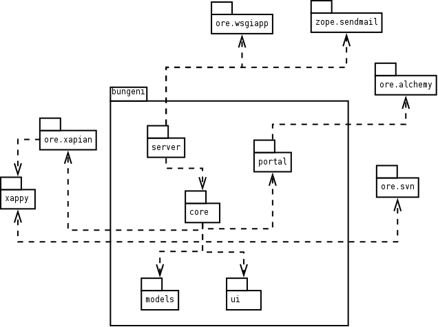
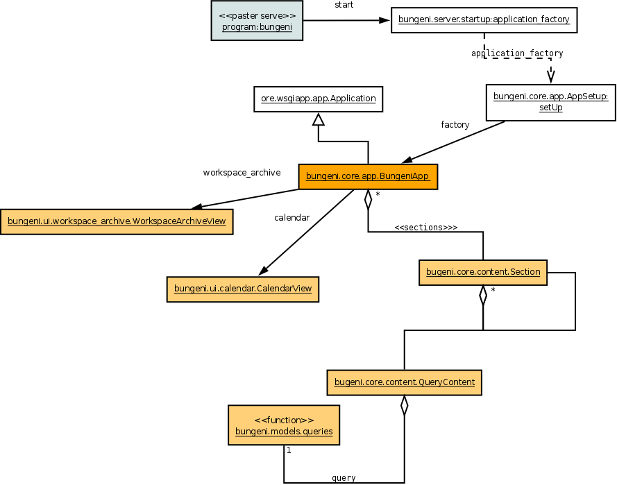
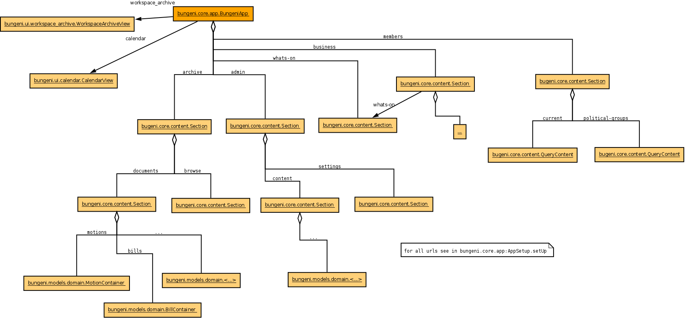
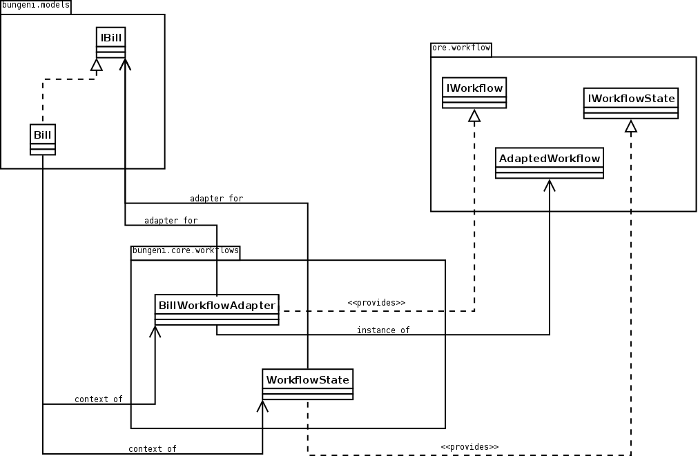
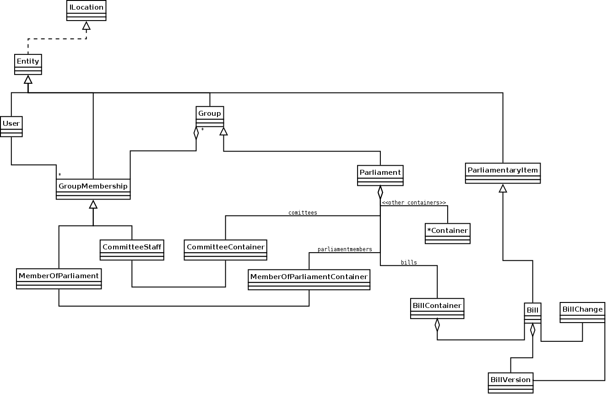
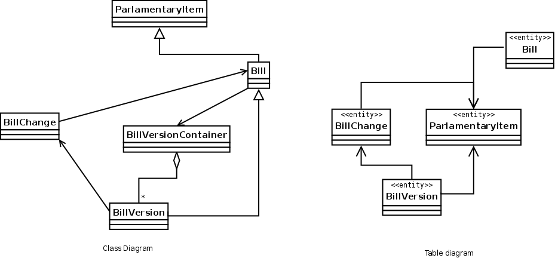
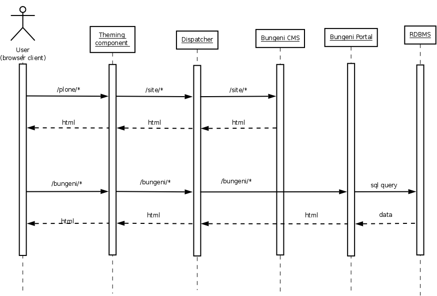
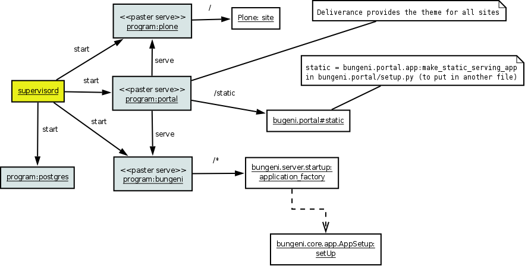

Software Architecture Overview
==============================

Scope
:::::

The scope of this section is to help a developer to understand the deployment configuration and to provide
an understanding of how to modify the existing features and to create new ones. The system is composed of
many different modules and each requires knowledge of the used technology, this section provides a global vision
and does not attempt to try to explain everything.

Description
:::::::::::

To describe the architecture of Bungeni, UML will be used. Some snippets of code will be provided where necessary to
describe bash file configurations, python code, paster and deliverance configuration files.

Software Requirements
=====================

Operating System
::::::::::::::::

Bungeni is easily run on Linux using the Ubuntu distro (11.04 and 10.04, 10.04 being recommended).

Middleware
::::::::::

Main Components
---------------

The following section describes the more programmatic views used by the Bungeni Portal.

Capistrano
----------

`Capistrano <https://github.com/capistrano/capistrano>`_ is a utillity and framework for executing commands in parallel on
multiple remote machines via SSH. It uses a simple DSL (*Domain Specific Language*) that allows you to define *tasks*, which may
be applied to machines in certain roles. It also supports tunnelling connections vai some gateway machine to allow operations
to be performed behind VPN's and firewalls.

Capistrano was originally designed to simplify and automate deployment of web applications to distributed environments, and
originally came bundled with a set of tasks designed for deploying Rails applications. Read the `docs <https://github.com/capistrano/capistrano/wiki/Documentation-v2.x>`_.

Supervisor
----------

`Supervisor <http://supervisord.org>`_ is a client/server system that allows its users to monitor and control a number
of processes on UNIX-like operating systems. It is responsible for starting programs at its own invocation, responding to
commands from clients, restarting crashed or exited subprocesses, logging its subprocess ``stdout`` and ``stderr`` output,
and generating and handling `events` corresponding to points in subprocess lifetimes. It provides a web user interface to view
and control process status.

`The above two components are part of the deployment system.`

Paster
------

Python Paste is a set of libraries to deploy WSGI applications, it covers all aspect of a CGI appliation: testing, dispatcher,
authentication, debugging and deployment. Specifically the Paste Deployment is a system for finding and configuring WSGI applications
and servers, it provides a single, simple function (loadapp) for loading a WSGI application from a configuration file or a Python Egg. The usual
way to deploy a WSGI application is to use ``paster serve``, this command line counterpart to serve an application using  a `Paste Deploy`
configuration file.

Deliverance
-----------

`Deliverance <http://http://packages.python.org/Deliverance/>`_ is a tool to theme HTML, applying a consistent style to applications and static files regardless of how they
are implemented, and separating site-wide styling from application-level templating. Deliverance takes the HTML from a source then applies a `theme` to
the HTML using something similar to XSLT transforms (but without restrictions).

Zope 2 and 3
------------

Zope is an open source web application server primarily written in the `Python <http://python.org>`_ programming language.
It features a transactional object database which can store ot only content and custom data, but also dynamic HTML templates,
scripts, a search engine, and relational database (RDBMS) connection and code. It features a strong through-the-web development
model, allowing you to update your website from anywhere in the world. Zope also features a tightly integrated security model.

BlueBream or Zope 3 is a rewrite by Zope developers of the Zope web application server. It is built on top of the Zope Tool Kit (**ZTK**).
The project tries to create a more developer-friendly and flexible platform for programming web applications. The original intent of BlueBream
was to become a replacement for Zope 2, however this did not happen as planned. Instead Zope 2 continued to make up the majority of
new Zope deployments, mostly due to the popularity of Plone. At this moment, many component of BlueBream are used in Zope 2 and in
other frameworks, and the community uses the term ZTK to define a set of libraries used as a basis for Zope3, Zope2, bfg and Grok
frameworks.

The main innovation of BlueBream is the `comonent architecture`, which allows structuring code into small, composable units with
introspectable interfaces, configurable through the ZCML files.

PostgresSQL
-----------

PostgresSQL is a powerful, open source object relational database system (**ORDBMS**), developed at the University of California at
Berkeley Computer Science Department. It has more than 15 years of active development and a proven architecture that has
earned it a strong reputation for reliability, and correctness. As an enterprise class database, PostgresSQL boasts of sophisticated
features such as Multi-Version Concurrency Control (**MVCC**), point in time recovery, tablespaces, asynchronous replication, nested
transactions (savepoints), online/hot backups, a sophisticated query planner/optimizer, and write ahead logging for fault tolerance.

SQLAlchemy
----------

`SQLAlchemy <http://sqlalchemy.org>`_ is the Python SQL toolkit and Object Relational Mapper (**ORM**) that gives application developers the full power and
flexibility of SQL. It provides a full suit of well known enterprise-level persistence patterns, designed for efficient and high-performing
database access, adapted into a simple and Pythonic DSL (*domain specific language*). SQLAlchemy doesn't view database as a collection
of tables; it sees them as relational algebra engines. Its ORM enables classes to be mapped against database tables in more than one way.
SQL constructs don't just select from just tables (you can also select from joins, subqueries, and uniions). Thus database relationships
and domain object models can be cleanly decoupled from the beginning.

Xapian
------

Xapian is an Open Source Search Engine Library. It is a highly adaptable toolkit which allows developers to easily index and integrate
advanced search facilities to their own applications. It supporst the Probabilistic Information Retrieval model and also supporst a
rich set of boolean query operators.

Plone
-----

Plone is a powerful, flexible Content Management System (CMS) that is easy to install, use and extend. Plone lets non-technical people
create maintain information using only a web browser. The main use of Plone is a basis for websites or intranets because of its modular
nature which helps the customization of all aspects. Plone is a product that runs on the Zope 2 application server, so it shares
the core functionalities like a components-based architecture, security and scalability.

Theming component
-----------------

Theming Component & Dispatcher
::::::::::::::::::::::::::::::

The system uses Deliverance to add a common theme to BungeniPortal and BungeniCMS. Deliverance is integrated in teh *paster* middleware,
so it is a *WSGI* application. Usually these type of applications are referred as pipeline components. Deliverance receives responses from the
applications mapped in the `dispatch` section then transform the HTML on the basis of the ``rules.xml`` file. In ``portal/deploy.ini`` there is::

    [pipeline:main]

    pipeline = deliverance

    dispatch

The paster application is launched from *supervisord* , see ``supervisord.conf`` in the section [``program:portal``].

The configuration for Deliverance is: ::

    [filter:deliverance]

    use = egg:bungeni.portal #deliverance

    ## use rule_file_host here since that's the internal server:port for deliverance rule_uri =

    http://%(rule_file_host)s/static/themes/rules.xml

The paster configuration "egg:bungeni.portal#deliverance" is related to the declaration in the ``setup.py`` of bungeni.portal egg: ::

    entry_points = """

    [paste.filter_app_factory]

    deliverance = bungeni.portal.middleware:make_deliverance_middleware

    [paste.app_factory]

    static = bungeni.portal.app:make_static_serving_app
    """

``make_deliverance_middleware`` is the factory method generating the real Deliverance app. When instantiated the
``rule_uri`` parameter is passed to the factory.

Dispatcher
----------

"egg:Paste#urlmap" is a standard component of the Paste framework. It maps the URLs to applications providing the
same features of a rewrite rule or proxy rule in Apache. For more information about ``urlmap`` refer to:
``http://pythonpaste.org/deploy <http://pythonpaste.org/deploy>``

Bungeni Portal
--------------

This diagram shows the main components of BungeniPortal:
Diagram 5: Packages in BungeniPortal

**bungeni.server**

The application is based on Zope3; this package contains the configuration of the libraries (what is included and excluded
to reduce the startup time) and the function ``application_factory`` that is used by ``paster serve`` command to launch
the application; it depends on ``ore.wsgiapp`` that allows bootstrapping a Zope3 environment as a *wsgi* application without
a ZODB backend. This package contains also the utility **SMTP Mailer** used for sending e-mail.

**bungeni.core**

This package contains the application started from the ``application_factory`` entry point of ``bungeni.server`` and the
contents creating the sections of the portal. The following diagram shows the main classes involved:

Diagram 6: bungeni.core interation

**bungeni.core.app**

The main class is AppSetup that is the factory adapter for the BungeniApp (IBungeniApplication). As the name stated it setups
the application:

    * create indexes for each content and add these to the ``indexer`` object that warps around Xapian i.e. using a file system storage for the index catalog: ::

        <buildoutpath>
        /parts/index

    * add to the application object the names bound to the functionalities. The application context is a dictionary-like object so for example the 'business' link is added as a key: ::

       business = self.context['business'] = Section( title=_(u"Business"),
                                description=_(u"Daily operations of the parliament."),
                                default_name = u"whats-on")

The sections are based on four types of classes.

    * ``bungeni.core.content.Section``: is an ``OrderedContainer``, a Zope3 class modelling a folder in which the contents container are maintained in order. For example, 'Business', 'Members', 'Archive' are Section contents. Note that usually the OrderedContainers are Persistent objects (in Zope sense) but in this case they are not stored at all.
    * ``bungeni.core.content.QueryContent``: a function that performs a SQL query is attached to this object, see ``bungeni.model.queries`` module. For example the "committees" and "bills" under business are QueryContent:::

        business[u"committees"] = QueryContent(
                    container_getter(get_current_parliament, 'committees'),
                    title = _(u"Committees"),
                    marker = interfaces.ICommitteeAddContext,
                    description = _(u"View committees created by the current parliament."))

    * ``bungeni.ui.calendar.CalendarView``: is a browser page that provides a calendar, see ``bungeni.ui``
    * ``bungeni.ui.workspace.archive.WorkspaceArchiveView``: is the user/member workspace, see ``bungeni.ui``

Below is a tree that shows the contents based on ``bungeni.models.domain``, they are the objects that mapped to tables
and rows in the RDBMS and accesed through the SQLAlchemy ORM. For example the section '*bills*' is a BillContainer, a
folderish object, and contains ``Bill`` from ``bungeni.models.domain``.

**Note**
``domain.Container`` is autogenerated by SQLAlchemy. Here is a partial diagram showing the objects and the relations with URLs.

Diagram 7: Bungeni package integration

**bungeni.core.workflows**

In ``bungeni.core.workflows`` there are configurations, factories and definitions of workflows used in the site. A workflow
is tied to a ``bungeni.model.domain`` content through a configuration basd on the interface. An example of the implmentation
for ``Bill`` content looks like (see: ``bungeni.models``):

Diagram 8: Workflows in ``bungeni.core``

In ``configure.zcml`` of ``bungeni.core.workflows`` for Bill there is: ::

    <adapter

    for = "bungeni.models.interfaces.IBill"
    provides = "ore.workflow.interfaces.IWorkflow"
    factory = ".adaptors.BillWorkflowAdapter" />

This means that ``BillWorkflowAdapter`` is the constructor of workflow for the class implementing the ``IBill`` interface.
The operation is done through the ``load_workflow`` method passed to the ``AdaptedWorkflow`` class (*not shown in the diagram*),
it reads the ``bill.xml`` file containing the description of the workflow in terms of states and transitions, and then generates
the workflow object. In a similar way, the state of workflow is managed by the ``WorkflowState`` class, it provides the access
to the state attribute in a ``Bill`` object; with this attribute the engine is able to determine the possible transitions
to other states.

For an explanation about entity based workflow engines see:
`http://www.zope.org/Members/hathawsh/DCWorkflow_docs/default/DCWorkflow_doc.pdf <http://www.zope.org/Members/hathawsh/DCWorkflow_docs/default/DCWorkflow_doc.pdf>`_ and
``workflow.txt`` in `http://pypi.python.org/pypi/ore.workflow <http://pypi.python.org/pypi/ore.workflow>`_ package.

**bungeni.models**

The main module of this package is 'domain', the module is rather complicated so this document reports only part of the inner classes
to show the general structure. The base class is ``Entity``: the main scope is to provide ``ILocation`` interface that is
used to declare the parent and the name of the object inside this parent container. The second important class is ``Parliament``,
the root of the system, contains the containers of committees, members, bills etc.

Below a partial view of the module:

Diagram 9: ``bungeni.models``

As example of implementations on Parliament object there is the 'bills' name that is a ``BillContainer`` container ``Bills``
objects. The ``Bill`` has two other classes associated:

    * ``BillVersion``: it is a reference to a ``Bill`` object
    * ``BillChange``: it is an operation done on an object

The tables for ``Bill``, ``BillVersion`` and ``BillChange`` are generated in ``bungeni.models.schema`` module, e.g.: ::

    bills = rdb.Table("bills", metadata,
            rdb.Column("bill_id", rdb.Integer, rdb.ForeignKey('parliamentary_items.parliamentary'), primary_key=True),
            rdb.Column("bill_type_id", rdb.Integer, rdb.ForeignKey('bill_types.bill_type_id'), nullable = False),
            rdb.Column("ministry_id", rdb.Integer, rdb.ForeignKey('groups.group_id')),
            rdb.Column("identifier", rdb.Integer),
            rdb.Column("summary", rdb.UnicodeText),
            rdb.Column("publication_date", rdb.Date),
            )
    bill_changes = make_changes_table(bills, metadata)
    bill_versions = make_versions_table(bills, metadata, parliamentary_items)

The table for versions and changes are generated through the methods ``make_changes_table`` and ``make_version_table``, they
create new tables with specific fields, in particular ``bills_versions`` contains the columns of the ``parliament_items`` table.
Below the relation between these classes (excerpt from classes and RDB table definitions):

Diagram 10: Relation between content type tables

Each ``Bill`` object is a ``ParliamentaryItem`` in terms of RDB, this means that for each row in ``Bill`` table, a
row is created in ``ParliamentaryItem`` table. If you modify a Bill object you are modifying a ``ParliamentaryItem`` row,
then the old values of this record are copied in a new ``BillVersion`` row and it generates a new ``BillChange`` row.

**bungeni.ui**

The following packages are provide the interface for various parts of the BungeniPortal:

    * forms package: content and container broswer views
    * calendar pakcage: contains the code to manage events associated to parliamentary items.
    * ``workspaces.py`` (and other modules): manage the access to items of a member for parliament.
    * ``workflow.py`` (and other modules): manage the interface to access the workflow functionalities.
    * ``versions.py`` (and others): provide the functionalities to access the item versions.

Bungeni CMS
-----------

At the moment of writing this document, Bungeni is powered by vanilla Plone with a minimal setup for the IA (*Information Architecture*).
Some portal sections are folder but in the final integration with Deliverance they are mapped on BungeniPortal URLs.
Refer to `http://www.plone.org <http://www.plone.org>`_ for more information about Plone. The version used is 3.3.3.

Minimal Hardware Requirements
=============================

Processor
:::::::::

Memory
::::::

Disk Space
::::::::::

Logical Views
=============

Logical Elements
::::::::::::::::

The main logical elements are described below:

    * Theming component: this provides a coherent look and feel to the BungeniPortal and BungeniCMS.
    * Dispatcher redirects the incoming requests to the correct URL inside the main applications.
    * BugneniPortal provides the parliament functionalities.
    * BugeniDB is a relational DB, it stores the data of BungeniPortal
    * BungeniCMS contains the general materials, it manages the content that is stored in the system. BungeniCMS uses an integrated object DB (not shown in the diagram)
    * Static resources are the images and CSS files which are served straight from the server's file system.

Diagram 1: Logical Elements

.. image:: images/logical.png

Theme Delivering
----------------

This component provides a coherent look-and-feel across all the applications in the site. The HTML coming from a source (e.g. Bungeni Portal or
BungeniCMS) is re-written based on a "theme" which is a static HTML page: the component extracts the parts from the page and fills the empty spaces
in the static template. This operation is done using a set of rules based on an XPath syntax.

Dispatcher
----------

This component simply calls the application using a mapping between URLs and apps.

BungeniPortal
-------------

This is the application that provides the specific parliament features, it can be broken up into the following sections:

    * *Business:* in this area there are the daily operations of the various parliament activities.
    * *What's on:* an overview of the daily operations of the parliament
    * *Committees:* list of committees, for each one there is metadata about the matter of discussion, membership and sittings.
    * *Bills:* list of bills and metadata for each bill. Actions are provided to version the bill and access the workflow associated with the bill.
    * *Questions:* list of questions and associated metadata about the matter of discussion, membership and sittings.
    * *Motions:* list of motions and associated metadata. Workflow and versioning actions are provided.
    * *Tabled documents:* list of tabled documents and metadata. Workflow and versioning actions are provided.
    * *Agenda items:* this is a list of agenda items and metadata.
    * *Sittings:* calendar showing the sittings of the plenary and the committees.
    * *Parliamentary publications:* this is a list of publications and information; these publications are the reports that come out of sittings.
    * *Members:* in this section, one can search for information about members of parliament (MPs)
    * *Member of parliament:* general information such as name and election date.
    * *Personal Info:* a complete biography of the member.
    * *Offices held:* information about offices in which the member has a title
    * *Parliamentary activities:* a list of content workflows the member has participated in. e.g. questions created by the member or motions moved by the member.
    * *Archive:* access to current and historical activities of the parliament, the categories are:

        * Parliaments
        * Political groups
        * Committees
        * Governments
    * *Workspace:* This is available for members of parliament and for clerks. This provides access to to the most relevant and current information for the user in a single page. e.g. for the Member of Parliament - the following

    * *Administration:* This is an administration section provided to the Admin. This is used for adding parliaments, new users, closing parliaments, entering preliminary metatdata etc.

The following diagram shows the logical components of the BungeniPortal.

Diagram 2: Logical Components of BungeniPortal

.. image:: images/logical_components.png

The versions and workflow functionalities provide traversals into the content; for example in a motion there are the links to past workflow states and older versions of the motion -
allowing the user to browse not just the current state of the motion but also the full audited history of the motion.

From some sections a user can reach contents in other sections. An example of this is the "Parliamentary activities" tab of a member,
it is possible to take a look at a bill moved by that MP (member of parliament).

BungeniCMS
----------

This is the content management system part of the portal, it provides a set of functionalities which are designed to:

    * Allow a large number of people of contribute to and share stored contents
    * Control access to contents, based on permissions
    * User roles or group membership define what each user can do (not only edit and view).
    * Improve communication between users using comments on contents.
    * Publication workflow and versioning support

The CMS contains various contents: documents, events, news, pictures, files are the main types.
The information architecture is organized in a tree structure, at this moment it looks as:

    * How we work
    * Rules and regulations
    * How parliament works
    * Seating plan
    * Administrative
    * Reference material
    * History of parliament
    * Online resources
    * Useful links
    * Picture gallery
    * Have your say
    * Vote in the election
    * Become an member of parliament
    * Present a petition
    * Visit parliament

This is the base structure but subject to changes due to the specificity of each parliaments.

Logical relationships
:::::::::::::::::::::

The following diagram shows how the different parts of the system communicate with each other:

Diagram 3: Logical Relationships

The request is passed from the 'theming component' to the dispatcher that call the designated application; the returned
html is processed from 'theming component' and release to the user. In this diagram is missing the 'paster server' component
that provides main access to the web server and manage the `wsgi` messages among the parts. As shown the components are for
the most not dependent upon each other: the 'theming component' an the Dispatcher merge backend applications, the BungeniCMS can
work without the others as the BungeniPortal (in this case however there is an explicit need for the RDBMS to store and retrive data).

Deployment of logical elements to hardware components
:::::::::::::::::::::::::::::::::::::::::::::::::::::

The starter point is the `supervisord` configuration: supervisord.conf (a file with structure similar to Microsoft Windows INI files).
From this file you can see which services compose the system and how they are started:

Diagram 4: Deployment

The sections are:

    * program:portal
    * program:plone
    * program:bungeni
    * program:postgres
    * program:openoffice

**program:portal**

Specify how all web servers and applications are reachable, they are served through Paster. Paster is a two-level command and the second level is pluggable, for
Bungeni `serve` that the ``serve`` command is used, which is a script to `serve` applications based on the WSGI interface (*similar to CGI*) using the
http protocol (see `http://pythonpaste.org/script/developer.html <http://pythonpaste.org/script/developer.html>`_). The configuration of `portal` is in
portal/deploy.ini: the `main` section defines a pipeline which filters requests through deliverance and serving a lot of urls: see [pipeline:main] then
[filter:deliverance] and [composite:dispatch] sections. Deliverance provides a uniform theme to all applications (`http://deliverance.openplans.org/index.html`_), it
intercepts the pages and via a set of rules applies a common look-and-feel. IN the `dispatch` section you can see the url mapped:

    * / = plone
    * /plone = plone

these are provided from server specified in [program:plone] of supervisord.conf

    * /static = static

this is provided directly as a `wsgi` service from the module bungeni.portal#static

**program:bungeni**

Bungeni Portal is served through paster with ``deploy.ini``, the mapped urls are ``'/'`` and ``'/cache'``. On ``'/'``
there is the real portal, a pipeline of ``repoze.who`` (WSGI authentication middleware) and bungeni.server (code in src/bungeni.server).
This one uses ``ore.wsgiapp`` and ``site.zcml`` is the Zope 3 instance configuration.

The names provided from bungeni sections are managed from ``bungeni.ui``: the names/urls are implemented as browser pages or
menu actions: see the configuration in ``src/bungeni.ui/bungeni/ui/menu.zcml`` (this requires understanding of zcml zope technology).

**program:plone**

BungeniCMS is based on Plone and it is served through paster (that is unusual for Plone) with the configuration file ``plone/etc/deploy.ini``.
The paster configuration is a pipeline of various middleware at end of which there is Zope2. The BungeniCMS is the `site` instance of Plone in the root of Zope.

**program:postgres**

The configuration to start up the PostgresSQL database server.

