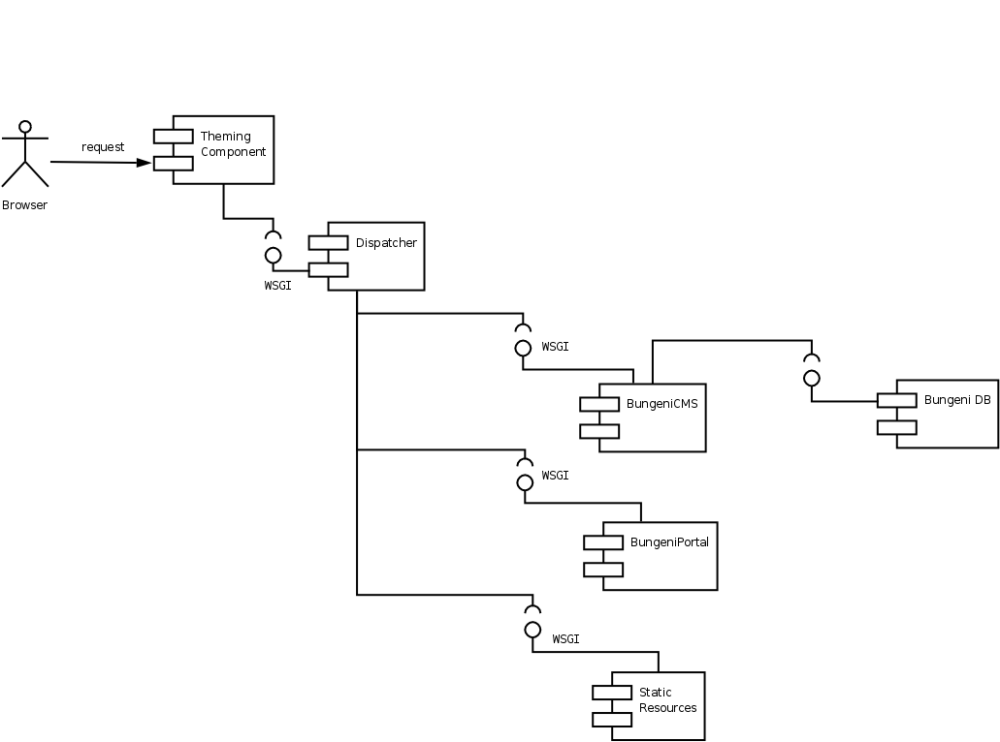
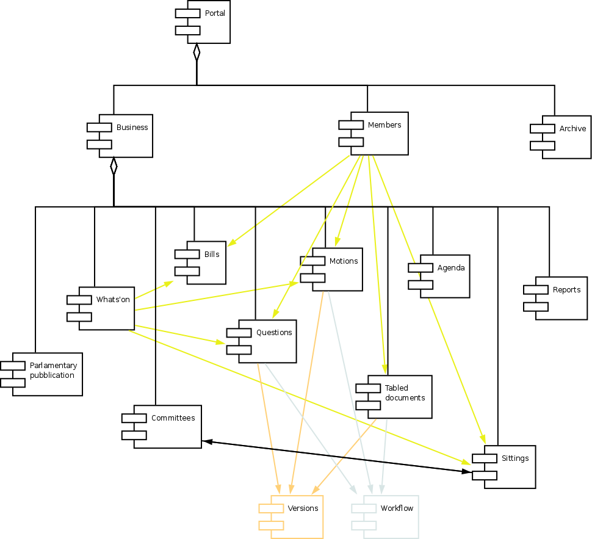

Software Architecture Overview
==============================

Scope
:::::

The scope of this section is to help a developer to understand the deployment configuration and to provide
an understanding of how to modify the existing features and to create new ones. The system is composed of
many different modules and each requires knowledge of the used technology, this section provides a global vision
and does not attempt to try to explain everything.

Description
:::::::::::

To describe the architecture of Bungeni, UML will be used. Some snippets of code will be provided where necessary to
describe bash file configurations, python code, paster and deliverance configuration files.

Logical Views
:::::::::::::

Logical Elements
----------------

The main logical elements are described below:

    * Theming component: this provides a coherent look and feel to the BungeniPortal and BungeniCMS.
    * Dispatcher redirects the incoming requests to the correct URL inside the main applications.
    * BugneniPortal provides the parliament functionalities.
    * BugeniDB is a relational DB, it stores the data of BungeniPortal
    * BungeniCMS contains the general materials, it manages the content that is stored in the system. BungeniCMS uses an integrated object DB (not shown in the diagram)
    * Static resources are the images and CSS files which are served straight from the server's file system.

Diagram 1: Logical Elements

Theme Delivering
----------------

This component provides a coherent look-and-feel across all the applications in the site. The HTML coming from a source (e.g. Bungeni Portal or
BungeniCMS) is re-written based on a "theme" which is a static HTML page: the component extracts the parts from the page and fills the empty spaces
in the static template. This operation is done using a set of rules based on an XPath syntax.

Dispatcher
----------

This component simply calls the application using a mapping between URLs and apps.

BungeniPortal
-------------

This is the application that provides the specific parliament features, it can be broken up into the following sections:

    * *Business:* in this area there are the daily operations of the various parliament activities.
    * *What's on:* an overview of the daily operations of the parliament
    * *Committees:* list of committees, for each one there is metadata about the matter of discussion, membership and sittings.
    * *Bills:* list of bills and metadata for each bill. Actions are provided to version the bill and access the workflow associated with the bill.
    * *Questions:* list of questions and associated metadata about the matter of discussion, membership and sittings.
    * *Motions:* list of motions and associated metadata. Workflow and versioning actions are provided.
    * *Tabled documents:* list of tabled documents and metadata. Workflow and versioning actions are provided.
    * *Agenda items:* this is a list of agenda items and metadata.
    * *Sittings:* calendar showing the sittings of the plenary and the committees.
    * *Parliamentary publications:* this is a list of publications and information; these publications are the reports that come out of sittings.
    * *Members:* in this section, one can search for information about members of parliament (MPs)
    * *Member of parliament:* general information such as name and election date.
    * *Personal Info:* a complete biography of the member.
    * *Offices held:* information about offices in which the member has a title
    * *Parliamentary activities:* a list of content workflows the member has participated in. e.g. questions created by the member or motions moved by the member.
    * *Archive:* access to current and historical activities of the parliament, the categories are:

        * Parliaments
        * Political groups
        * Committees
        * Governments
    * *Workspace:* This is available for members of parliament and for clerks. This provides access to to the most relevant and current information for the user in a single page. e.g. for the Member of Parliament - the following

    * *Administration:* This is an administration section provided to the Admin. This is used for adding parliaments, new users, closing parliaments, entering preliminary metatdata etc.

The following diagram shows the logical components of the BungeniPortal.

Diagram 2: Logical Components of BungeniPortal

